 ### DEMO GIÁM SÁT SỬA ĐỔI HỆ THỐNG FILE BẰNG WAZUH
 ## Kịch bản tấn công

 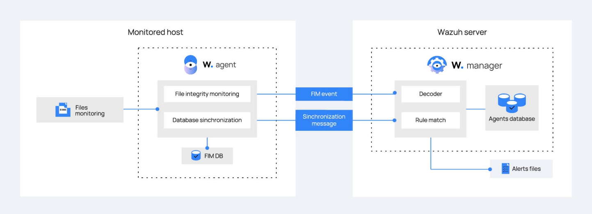

 Wazuh tích hợp sẵn khả năng giám sát tính toàn vẹn của tệp (FIM), giúp theo dõi các thay đổi quan trọng trên hệ thống. Mô-đun FIM hoạt động bằng cách lưu trữ giá trị checksum và thuộc tính tệp, sau đó so sánh với dữ liệu hiện tại để phát hiện sự thay đổi. Khi một tệp bị chỉnh sửa, tạo mới hoặc xóa, Wazuh Agent sẽ phân tích mức độ thay đổi và gửi sự kiện đến Wazuh Server để xử lý.
Wazuh Agent hoạt động trên các máy được giám sát, theo dõi các tệp và thư mục quan trọng được cấu hình trong ossec.conf. Nó sử dụng hai phương pháp phát hiện thay đổi: so sánh giá trị checksum để xác định nội dung bị sửa đổi và kiểm tra thuộc tính tệp để phát hiện truy cập trái phép. Dữ liệu này được lưu trong FIM Database, hỗ trợ so sánh với dữ liệu cũ để đánh giá mức độ thay đổi.
Sau khi phát hiện thay đổi, Agent gửi sự kiện theo hai hình thức: FIM Event cho các thay đổi quan trọng và Synchronization Message để cập nhật định kỳ. Wazuh Server sau đó phân tích sự kiện, đối chiếu với quy tắc bảo mật. Nếu phát hiện rủi ro, hệ thống có thể ghi nhận vào log, gửi cảnh báo đến quản trị viên hoặc thực hiện các biện pháp phản hồi tự động như khóa tài khoản, gửi email hoặc chặn địa chỉ IP đáng ngờ.
Quy trình này giúp đảm bảo tính toàn vẹn của hệ thống, giảm thiểu rủi ro bảo mật và phát hiện sớm các hành vi xâm nhập trái phép.

## Dựng demo
Trong demo này, nhóm sẽ sử dụng hai máu
1 máy ảo ubuntu chứa wazuh server

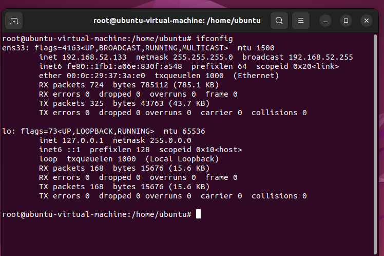

1 máy ảo windows server 2022 chứa wazuh agent

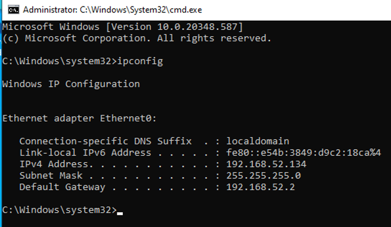

# Thử nghiệm
Tạo một directory có đường dẫn C:\Users\Public

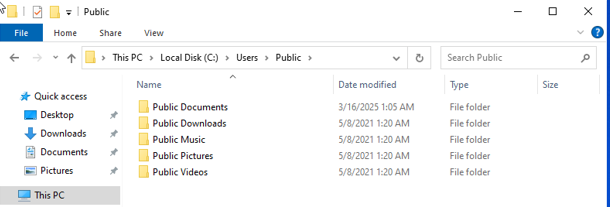

Chúng nhóm sẽ thực hiện giám sát sự thay đổi của các file trong folder này trên máy Windows Server 2022
- Truy cập file C:\Program File (x86)\ossec-agent\ossec.conf sau đó copy đường dẫn file muốn giám sát  C:\Users\Public đó là “<directories whodata="yes" report_changes="yes">C:\Users\Public</directories>” và lưu.

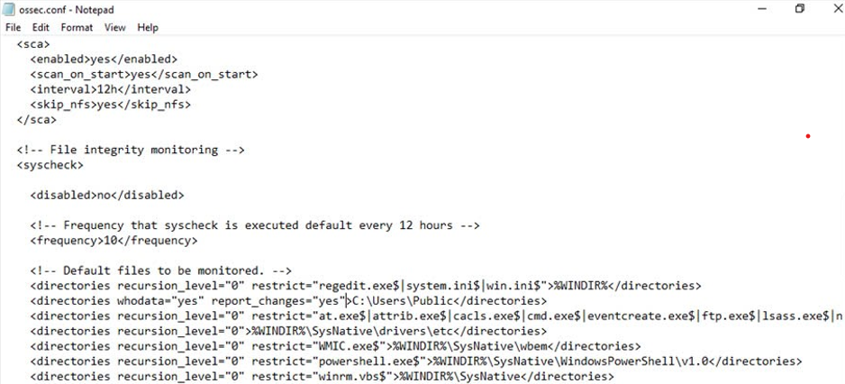

Với những thay đổi này folder Public sẽ được giám sát với các sự thay đổi như thêm, sửa, xóa sẽ được thông báo về wazuh server. Ngoài ra whodata = “yes’ và report_changes = “yes” nhóm sẽ biết được thông tin người dùng và nội dung thay đổi của tệp
restart wazuh với câu lệnh Restart Service -Name Wazuh trên PowerShell với quyền admin

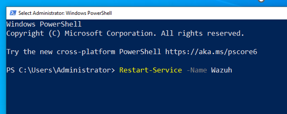

Khi restart thì Wazuh server sẽ bắt đầu ghi nhận những thay đổi trong folder Public 
- thực hiện sửa đổi các thư mục bên trong đường dẫn C:\Users\Public
+) Thêm file text BankAccount vào folder Public document

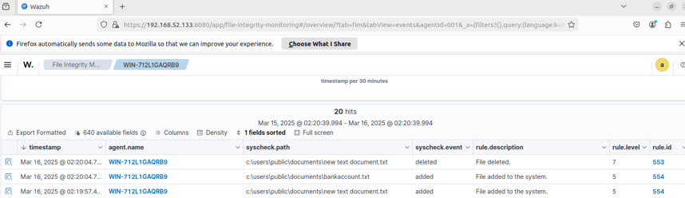

Như thông báo Wazuh Server đã ghi nhận sự thay đổi cụ thể là tạo file text BankAccount

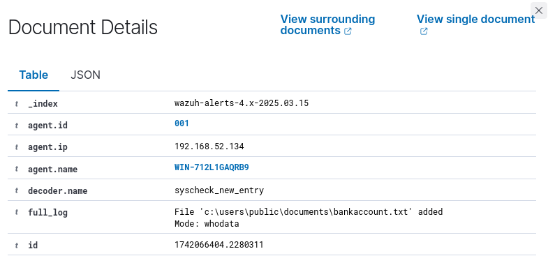

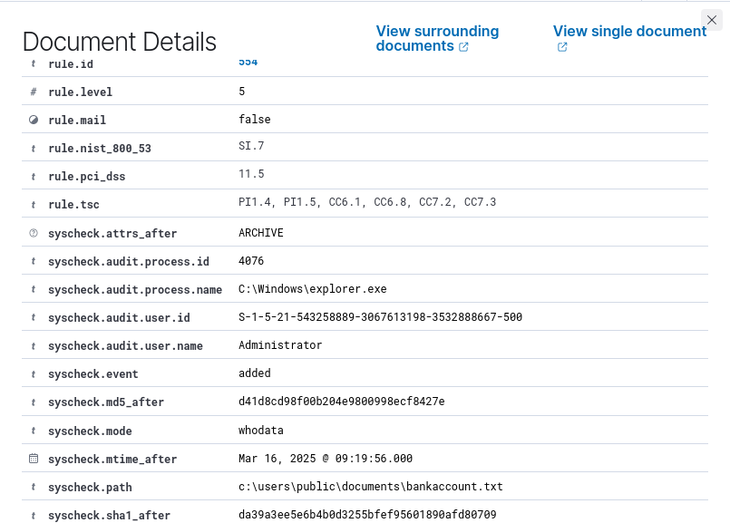

Như chúng ta thấy Wazuh server đã ghi nhận sự thay đổi cụ thể báo cáo có đề cập đến ID của máy thay đổi (192.168.52.134), cung cấp cả process id (4076) process name 	
(C:\Windows\explorer.exe), user name (Adminitrator) và rất nhiều thông tin khác 
+) Ngoài ra Wazuh server cũng sẽ ghi nhận những thay đổi trong registry

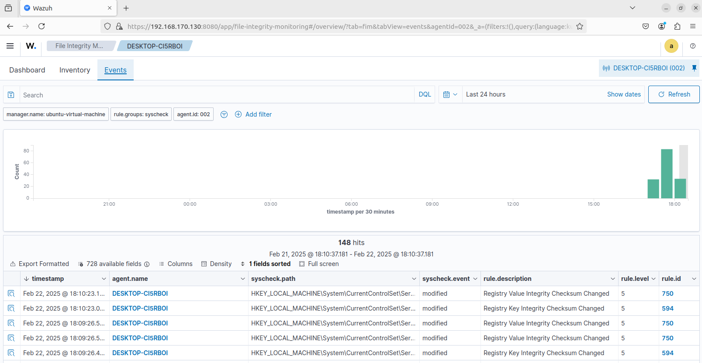

Tương tự với xóa file, thực hiện thay đổi nội dung trong file BankAccount
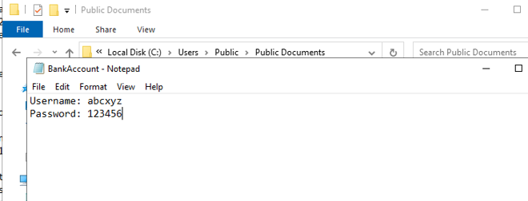

Đổi nội dung trong file BankAccount thành

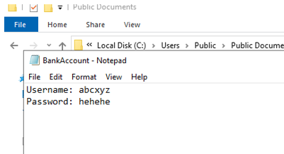

Qua đó bên Wazuh Server cũng sẽ nhận được thông báo về việc file được thay đổi

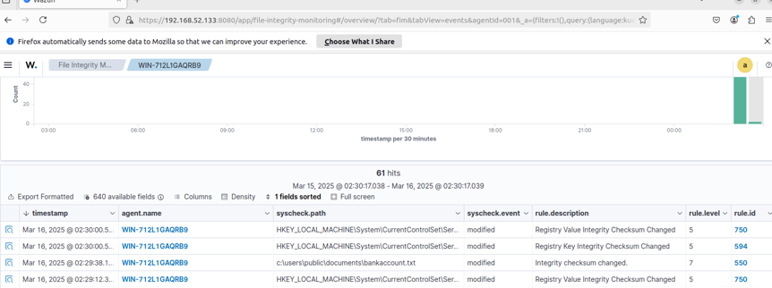

Xem kĩ hơn về thông báo về việc thay đổi file text

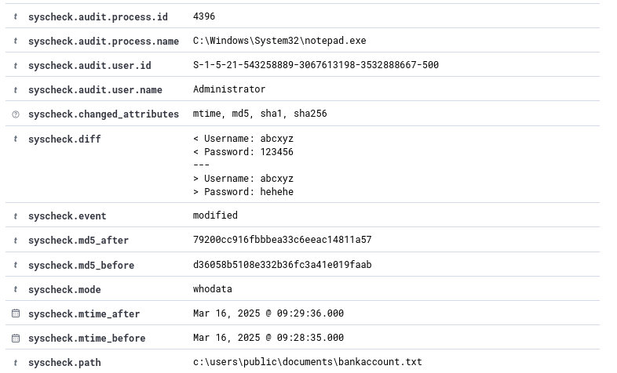

