# Wazuh--IDS-IPS
## Lý thuyết về Wazuh
1️⃣ Giới thiệu Wazuh

Wazuh là nền tảng SIEM (Security Information and Event Management) và IDS/IPS (Intrusion Detection/Prevention System) mã nguồn mở.

Chức năng chính:

Phân tích nhật ký (log analysis).

Giám sát tính toàn vẹn tệp (File Integrity Monitoring - FIM).

Phát hiện phần mềm độc hại và hành vi bất thường.

Quản lý tuân thủ (PCI DSS, GDPR, HIPAA, NIST…).

Hỗ trợ phản ứng chủ động (Active Response) để ngăn chặn tấn công.

2️⃣ Các thành phần chính của Wazuh

Wazuh Agent: Cài đặt trên endpoint (Windows, Linux, macOS, cloud instance). Thu thập log, giám sát hệ thống, gửi dữ liệu về server.

Wazuh Server:

Phân tích dữ liệu từ agent thông qua decoders & rules.

Quản lý agent, cấu hình, cập nhật từ xa.

Kích hoạt cảnh báo và phản ứng chủ động.

Wazuh Indexer: Lưu trữ & lập chỉ mục dữ liệu log/cảnh báo, hỗ trợ tìm kiếm & phân tích real-time.

Wazuh Dashboard: Giao diện web để trực quan hóa, phân tích dữ liệu, quản lý agent và cấu hình hệ thống.

Cơ chế giao tiếp:

Agent ↔ Server: Kết nối bảo mật (AES/TLS).

Server ↔ Indexer: Thông qua Filebeat, dữ liệu được lập chỉ mục và lưu trữ.

Dashboard ↔ Server: Sử dụng RESTful API để quản lý và hiển thị dữ liệu.

3️⃣ Cài đặt và cấu hình Wazuh

## Cài đặt 3 thành phần chính: Indexer, Server, Dashboard.
# Cài đặt và cấu hình wazuh-server

Đầu tiên, cập nhật hệ thống lên phiên bản mới nhất bằng lệnh:
curl –s0 http://package.wazuh.com/4.x/wazuh-install.sh
Sau đó, tải package của wazuh về, bằng lệnh:
curl –s0 http://package.wazuh.com/4.x/wazuh-install.sh
curl –s0 http://package.wazuh.com/4.x/config.yml
(x trong 4.x là phiên bản muốn tải, ở đây nhóm sử dụng bản 4.7)
Sau khi chắc chắn 2 file wazuh-install.sh và config.yml được tải về, tiến hành chỉnh sửa file config.yml với lệnh: vim config.yml

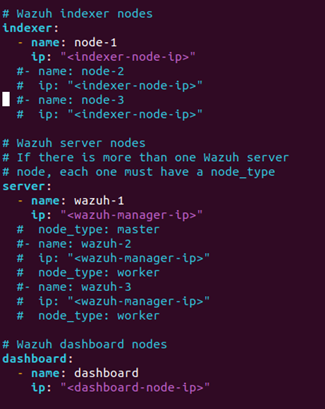

Tiếp theo, kiểm tra địa chỉ IP của máy bằng lệnh ip address

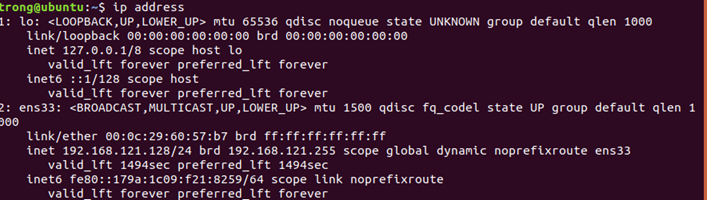

Quay lại file config.yml, và sửa ip của indexer, server và dashboard trùng với ip của máy 

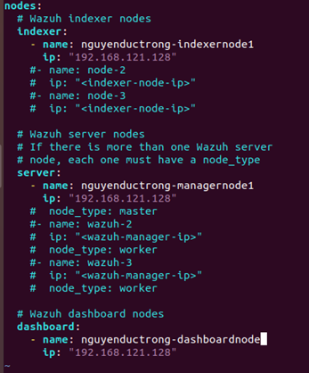

Sau khi sửa xong, thoát file bằng Esc và gõ :wq để thoát, dùng lệnh (sudo) bash wazuh-Install.sh --generate-config-files để chạy script cài đặt Wazuh, với file config được sửa từ trước

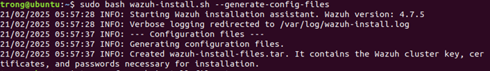

Kiểm tra nếu như có file đuôi .tar là đã bash thành công, bằng lệnh ll

Làm tương tự với file indexer của wazuh bằng lệnh (sudo) bash wazuh-Install.sh –wazuh-indexer (tên đã được chỉnh sửa trong phần indexer của file config)

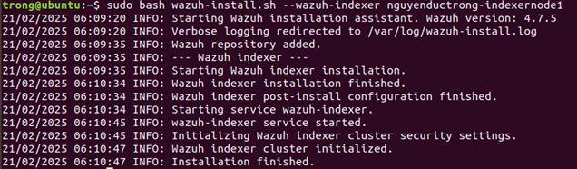

Dùng lệnh bash 1 lần nữa với start-cluster bằng lệnh: (sudo) bash wazuh-Install.sh –start-cluster

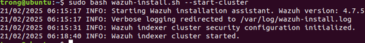

Sau đó, nhóm sẽ trích xuất tên username và password của indexer trong file wazuh-passwords.txt bằng lệnh tar -0 -xaf wazuh-install-files.tar wazuh-install-files/wazuh-passwords.txt | grep -E "indexer_username|indexer_password"

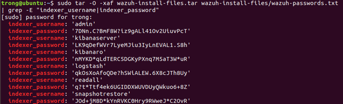

Ta kiểm tra tình trạng hoạt động của indexer admin bằng lệnh: curl –k –u admin:(password của admin) https://(ip của máy):9200 (9200 là cổng wazuh indexer dùng)

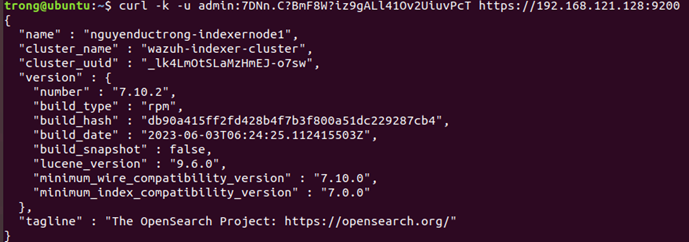

Ta tiếp tục cài đặt wazuh manager bằng lệnh (sudo) bash wazuh-install.sh –wazuh-server (tên đã được chỉnh sửa trong phần server của file config)

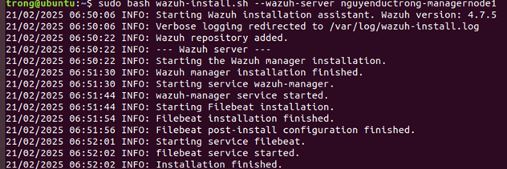

Ta cài nốt wazuh dashboard bằng câu lệnh (sudo) bash wazuh-install.sh --wazuh-dashboard (tên đã được chỉnh sửa trong phần dashboard của file config) ghi nhớ user và password

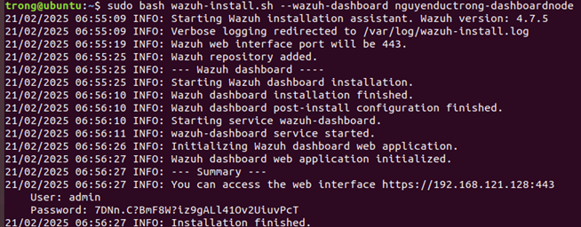

 Ta truy cập vào đường link https://(ip của máy) và sử dụng user và password có được từ wazuh dashboard (hình 14)
Như vậy là nhóm đã cài đặt thành công Wazuh

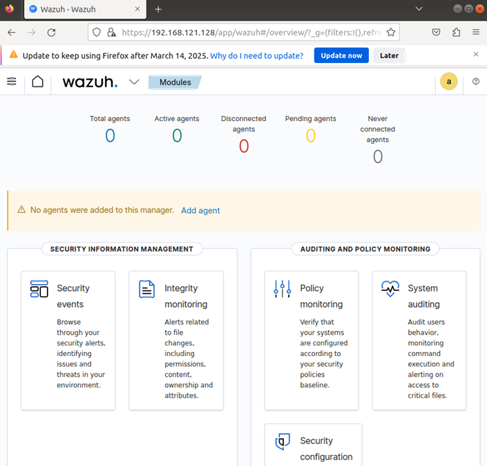

# Cài đặt và cấu hình wazuh-agent
Trên trang dashoard của wazuh, chọn mũi tên chỉ xuống nằm giữa tên Wazuh. và Modules rồi bấm vào Agents

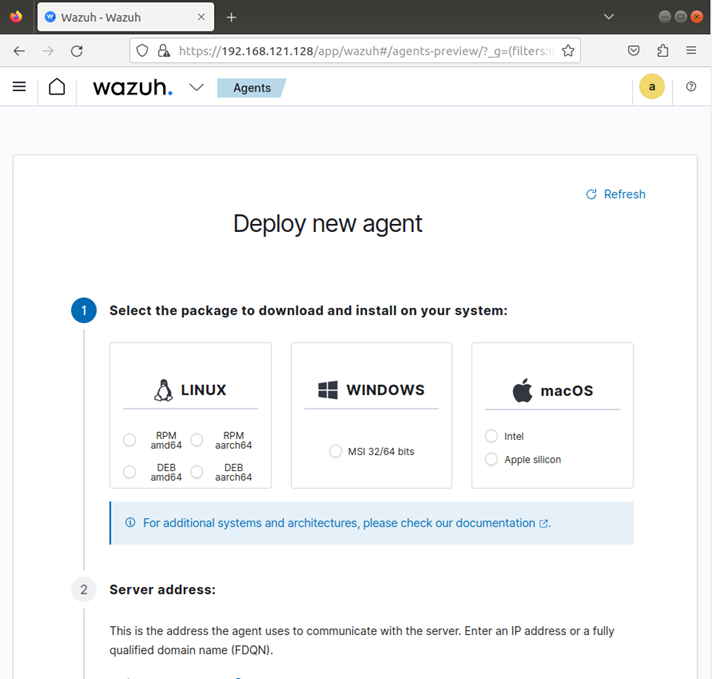

Nhấn vào lựa chọn DEBamd64 của Linux ở mục 1, điền địa chỉ ip của máy wazuh hoặc tên domain của máy wazuh ở mục 2, có thể đặt tên cho máy agent và nhóm có máy agent ở mục 3, copy câu lệnh ở mục 4
Chuyển sang máy Ubuntu 22, mở Terminal bằng quyền root và nhập câu lệnh copy vào (hoặc sử dụng sudo)

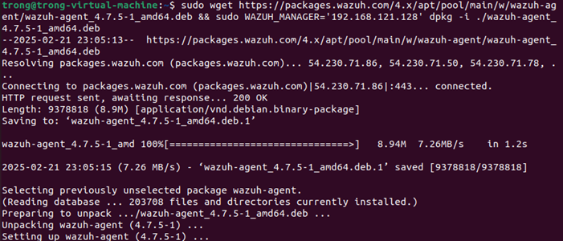

Sau đó dùng lần lượt các lệnh
(sudo) systemctl daemon-reload
(sudo) systemctl start wazuh-agent
(sudo) systemctl enable wazuh-agent

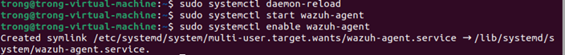

Cuối cùng, nhóm quay lại máy có cài wazuh manager, nhấn Close để đóng new agent lại, và có thể thấy trạng thái hiển thị có thêm 1 wazuh agent

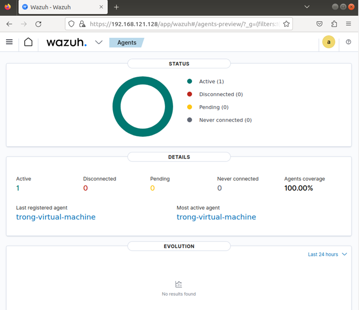

Sau khi cài đặt thành công, agent kết nối về server và hiển thị trong dashboard.

4️⃣ Hệ thống luật (Rules) trong Wazuh

Rules là trung tâm phát hiện sự kiện bảo mật. Được viết bằng XML, áp dụng trên log đã được giải mã.

Có 2 loại:

Default rules: Có sẵn trong thư mục /var/ossec/ruleset/rules/.

Custom rules: Người dùng tự định nghĩa tại /var/ossec/etc/rules/local_rules.xml.

Các rule có ID duy nhất, mức độ cảnh báo (Level 0–15).

Rule có thể được tạo mới hoặc ghi đè lên rule mặc định bằng thẻ overwrite="yes".

Ví dụ:

Rule phát hiện nhiều lần đăng nhập SSH thất bại → cảnh báo brute force.

Rule giám sát thay đổi tệp hệ thống → cảnh báo FIM.

5️⃣ Active Response

Cho phép phản ứng tự động khi phát hiện tấn công.

Ví dụ:

Phát hiện brute force SSH → tự động chặn IP tấn công bằng firewall.

Phát hiện tiến trình độc hại → dừng tiến trình.

Giúp giảm thiểu thiệt hại trước khi quản trị viên kịp xử lý.

👉 Tóm lại, Wazuh là một hệ thống mạnh mẽ, kết hợp giám sát an ninh tập trung + phát hiện xâm nhập + phản ứng tự động. Hai chương đầu cung cấp nền tảng lý thuyết quan trọng: từ kiến trúc, cơ chế hoạt động, đến cách cài đặt, cấu hình và xây dựng luật bảo mật trong Wazuh.
