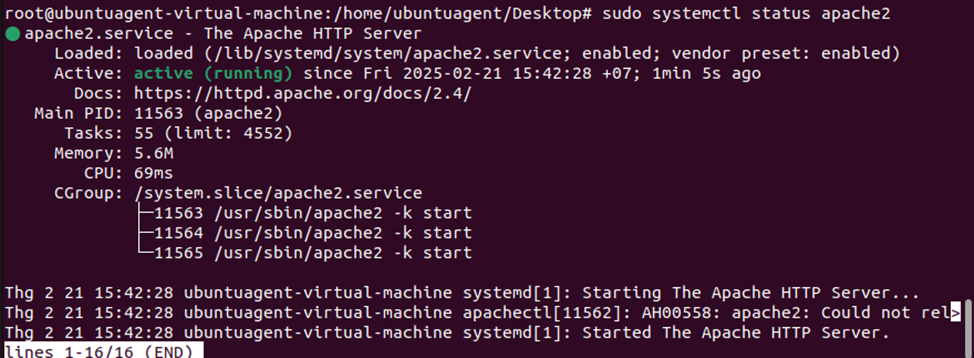
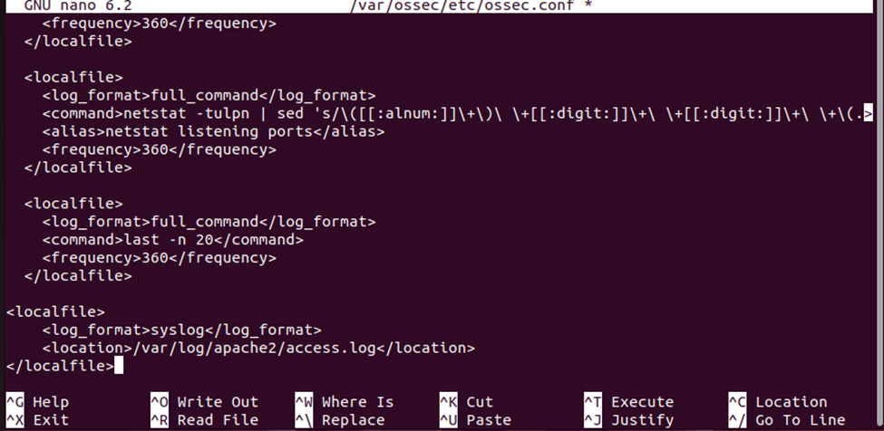
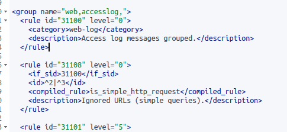
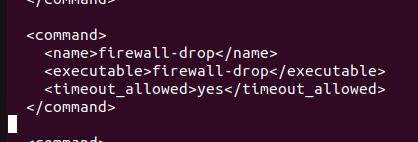
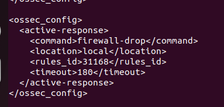
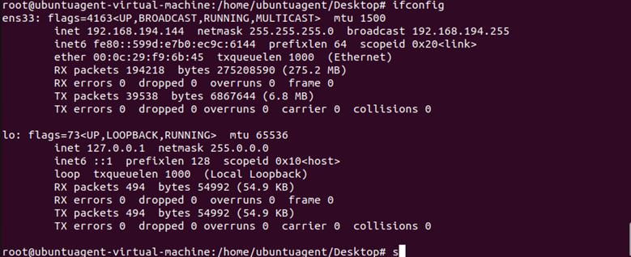
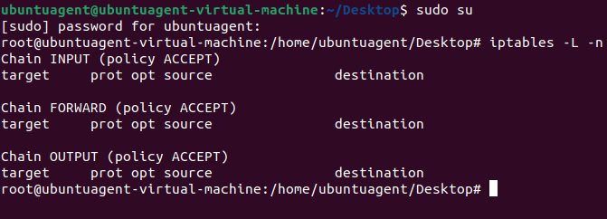
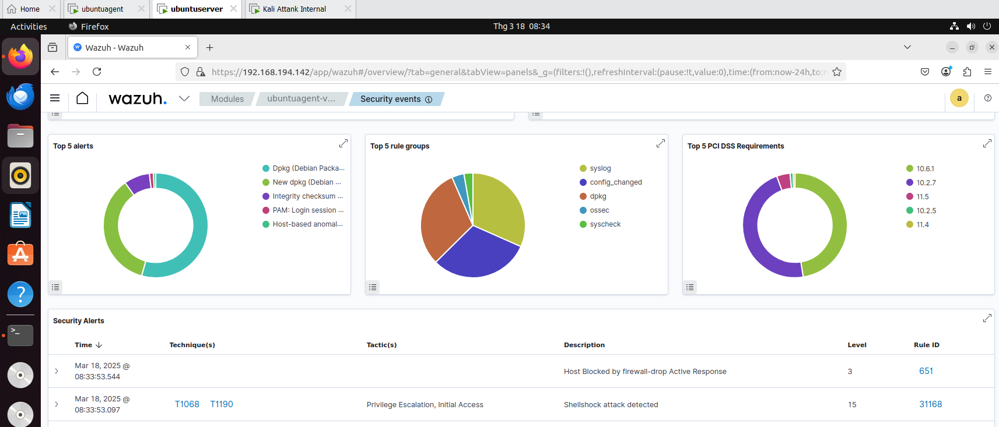
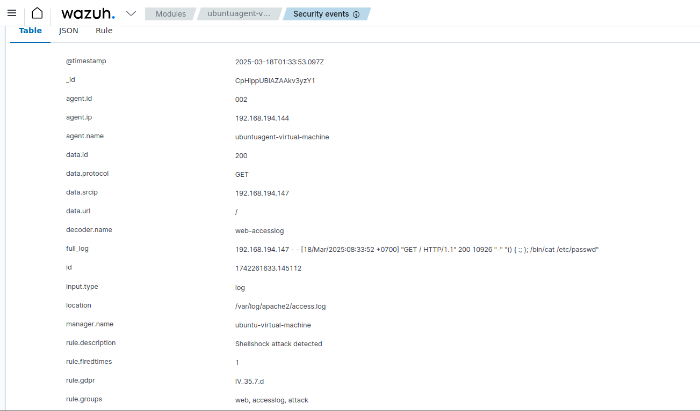
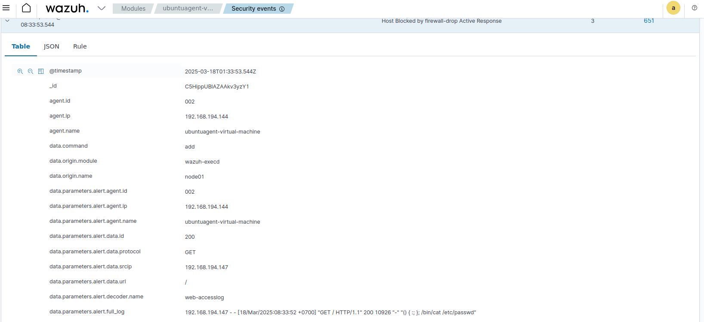

### DEMO GIÁM SÁT VÀ CẢNH BÁO TẤN CÔNG SHELLSHOCK
## Kịch bản tấn công
hellshock là một lỗ hổng nghiêm trọng được phát hiện vào năm 2014 trong Bash, một trình thông dịch lệnh phổ biến trên Unix/Linux và macOS. Lỗ hổng này cho phép kẻ tấn công thực thi mã tùy ý trên hệ thống từ xa bằng cách chèn mã độc vào các biến môi trường trước khi Bash được gọi. Điều này có thể dẫn đến việc kiểm soát hoàn toàn hệ thống, đánh cắp dữ liệu hoặc thực hiện các cuộc tấn công khác. Shellshock ảnh hưởng đến nhiều hệ thống, đặc biệt là các máy chủ web sử dụng CGI, và đã bị khai thác rộng rãi ngay sau khi được công bố.
Nhiều dịch vụ mạng, như các máy chủ web, sử dụng Bash để thực thi lệnh khi cần thiết, cho phép kẻ tấn công khai thác lỗ hổng bảo mật Shellshock ở những phiên bản Bash lỗi để phục vụ những mục đích đen tối của chúng. Lỗ hổng bảo mật này giúp kẻ tấn công chiếm quyền điển khiển các máy nạn nhân mà không cần phải qua bước xác thực.
Khi một web server sử dụng CGI để xử lý các yêu cầu (request), thông tin từ request được truyền vào chương trình xử lý dưới dạng biến môi trường. Ví dụ, biến `HTTP_USER_AGENT` thường chứa thông tin về trình duyệt gửi yêu cầu. Nếu web server chạy các lệnh Bash hoặc gọi các lệnh hệ thống, Bash sẽ nhận và xử lý các biến môi trường này. Kẻ tấn công có thể chèn mã độc vào biến `User-Agent` của yêu cầu và khai thác lỗ hổng Shellshock trên web server.
Trong thử nghiệm này, nhóm sử dụng Wazuh để giám sát và cảnh báo tấn công shellshock từ máy tấn công đến máy nạn nhân (wazuh-agent). Wazuh server sẽ thu thập log từ Wazuh agent, cụ thể là log của máy chủ web Apache để biết được khi nào máy nạn nhân bị tấn công. Máy tấn công sẽ thực hiện tấn công Shellshock đến máy nạn nhân bằng cách gửi một request độc hại đến máy nạn nhân để tấn công. Wazuh-server sẽ dựa trên các log thu thập được và thông báo ra màn hình giám sát (Dashboard) phát hiện tấn công để cảnh báo tới người quản trị.

## Dựng demo

Kịch bản tấn công gồm có:
Máy Ubuntu 22.04 – Wazuh Server: thực hiện giám sát máy Agent Ubuntu
Máy Ubuntu 22.04 – Wazuh Agent: cài đặt và chạy máy chủ web Apache
Máy Kali Linux – Attacker : Thực hiển gửi HTTP độc hại đến máy chủ web của nạn nhân.
Tại máy Ubuntu Agent, cài đặt đặt máy chủ web Apache
sudo apt install apache2

Thực hiện chỉnh sửa tường lửa để có thể cho phép truy cập bên ngoài vào cổng web.
sudo ufw app list
sudo ufw allow 'Apache'
sudo ufw status

Kiểm tra lại dịch vụ máy chủ web có chạy không
sudo systemctl status apache2

Thực hiện chỉnh sửa file /var/ossec/etc/ossec.conf  để thiết lập Wazuh có thể giám sát truy cập của máy chủ Apache bằng cách thêm cấu hình sau:
<localfile>
      <log_format>syslog</log_format>
      <location>/var/log/apache2/access.log</location>
</localfile>
 Cấu hình trên sẽ giúp Wazuh sẽ giám sát tệp /var/log/apache2/access.log – đây là đường dẫn đến tệp nhật ký của Apache Access Log, nơi lưu lại mọi yêu cầu HTTP được gửi đến máy chủ Apache, cho nên nó thu thập dữ liệu từ nhật ký truy cập Apache để phân tích lưu lượng truy cập vào máy chủ.

Khởi động lại Wazuh Agent để lưu cấu hình sử dụng sudo systemctl restart wazuh-agent
# Tại máy chủ Wazuh
Ấn vào biểu tượng Wazuh góc trái bên trên, chọn Management, chọn Rules -> Manager rules files và tìm kiếm từ “web” để tìm nơi lưu trữ luật. Rule 31100 sẽ là việc theo dõi web-log của máy chủ web, rule 31108 sẽ thực hiện kiểm tra các HTTP response và cuối cùng rule 31168 trong file 0245-web_rules.xml là rule chịu trách nhiệm phát hiện tấn công Shellshock khi máy chủ sẽ bắt dữ liệu trong log có chứa payload tấn công shellshock hay không.

Trên máy Wazuh-manager, sử dụng câu lệnh: sudo nano /var/ossec/etc/ossec.conf, kiểm tra phần command firewall-drop đã được cấu hình sẵn sẽ thực thi script firewall-drop ở trên máy endpoint khi được máy chủ wazuh gọi.

Tại file này, ta cấu hình thêm quy tắc để thực hiện hành động firewall-drop với ngữ cảnh là việc Wazuh phát hiện được một sự kiện khớp với rules ID là 31168, và thực hiện script trên máy cục bộ, cụ thể là máy endpoint, có hiệu lực 180 giây trước khi tự động gỡ bỏ

Sau đó khởi động lại wazuh-manager với câu lệnh
Sudo server wazuh-manager restart
# Thử nghiệm
Xem địa chỉ IP của máy Ubuntu

Đăng nhập vào máy Kali (máy tấn công), gửi lệnh sau:
sudo curl -H "User-Agent: () { :; }; /bin/cat /etc/passwd" <WEBSERVER_IP_ADDRESS>

Với lệnh trên máy tấn công sẽ thực hiện một cuộc tấn công Shellshock đến máy chủ web có địa chỉ IP : 192.168.194.144 để khai thác lỗ hổng trong trình xử lý CGI( Common Gate Interface) của Apache bằng cách gửi một yêu cầu HTTP/HTTPS độc hại, chèn mã độc vào tiêu đề User-Agent trong một yêu cầu HTTP, nhằm buộc máy chủ thực thi lệnh Bash trái phép (/bin/cat /etc/passwd). Nếu máy chủ dễ bị tấn công, kẻ xấu có thể thu thập thông tin người dùng hệ thống hoặc thực hiện các cuộc tấn công tiếp theo.

Sau khi tấn công, thấy Wazuh Server thông báo rằng có tấn công Shellshock tại máy Ubuntu Agent đã được đăng ký để giám và thông báo firewall-drop máy tấn công.

Thực hiện xem chi tiết thông báo, ta có thể thấy các thông tin chi tiết của cảnh báo và địa chỉ Ip của bên tấn công :192.168.194.147 và full_log đã được theo dõi.

Đồng thời thông báo Host Blocked by firewall-drop Active Response nghĩa là IP máy tấn công đã bị chặn bởi rule

Kiểm tra iptables của máy nạn nhân, ta thấy iptables đã được cập nhật.

